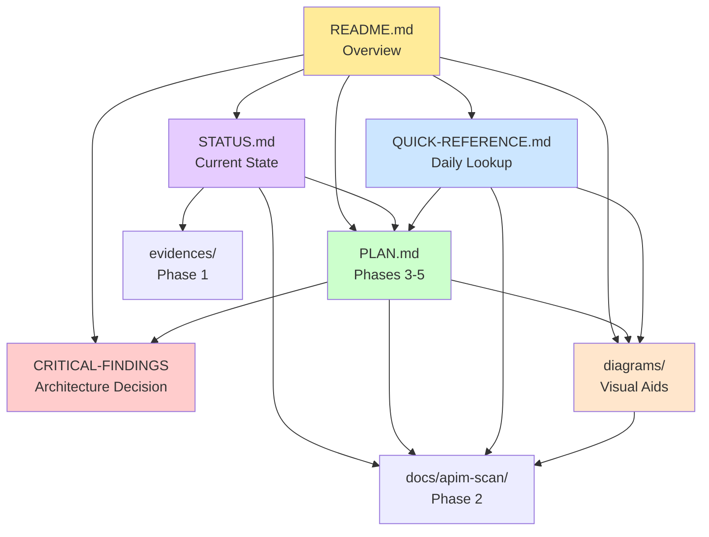

# OVERVIEW: Getting APIM into InfoJP PoC

**Project Status**: Phase 2 Complete (Feb 4, 2026) | Documentation 100% Validated ✅  
**Next Phase**: Phase 3 (APIM Design) - Ready to Start  
**Evidence-Based**: All claims verified against source code ([Audit Report](./ACCURACY-AUDIT-20260204.md))

---

Here's a practical **end-to-end overview** for implementing **APIM** in **MS-InfoJP**, assuming your intent is: **frontend never talks directly to backend services**, and APIM becomes the **single governed ingress** (auth, throttling, headers, logging, versioning, transformations).

---

## Core Idea

You'll do two things in parallel:

1. **Inventory InfoJP's outbound HTTP calls** (UI → backend, backend → Azure services / external sources)
2. Stand up **APIM as the "front door"** and progressively **route those calls through APIM** with policies

In practice, you'll usually front **the InfoJP backend API** first (because it's the app contract), then optionally front **downstream dependencies** (Search, Storage, etc.) if you want centralized governance.

---

## Process Overview (Phased)

### Phase A — Inventory & Classify Calls

**Goal**: Produce a list of *every* HTTP call InfoJP makes, and decide what APIM should own.

**A1. Find all HTTP client code paths**
* Frontend: `fetch`, `axios`, `XMLHttpRequest`, `graphql`, SSE/WebSocket, etc.
* Backend: REST clients, SDKs that ultimately call HTTP (OpenAI, Search, Storage via REST), webhook calls, etc.

**A2. Build the API inventory table**
For each call, capture:
- **Caller** (UI / backend job / ingestion worker)
- **Target host** (e.g., `infojp-api`, `openai.azure.com`, `*.search.windows.net`)
- **Path + method**
- **Auth model** (cookie, bearer, key, managed identity)
- **Data classification** (Protected B context)
- **Traffic type** (interactive vs batch)
- **Latency sensitivity**
- **Must-have governance** (quota, per-user attribution, audit fields)

**Decision**:
- ✅ Put behind APIM: **UI → InfoJP backend APIs** (always)
- 🟡 Optional behind APIM: backend → internal platform APIs (your "EVA Brain contracts" path)
- 🔴 Usually not behind APIM: high-volume internal service-to-service calls if you already have private networking + service identity + internal gateway (depends on your governance stance)

**Deliverable**: **InfoJP API Call Inventory.md**

---

### Phase B — Define the "External Contract" (What APIM Will Expose)

**Goal**: Make a crisp, minimal set of APIs that UIs and consumers will call.

**B1. Normalize to a small set of endpoints** (typical Info Assistant patterns)
You'll likely end up with something like:
- `POST /chat` (or `/ask`)
- `POST /chat/stream` (SSE)
- `POST /feedback`
- `GET /health`
- optional: `GET /sources/{id}`, `POST /search`, `POST /admin/reindex`

**B2. Define headers you want enforced**
If you're pursuing EVA-style governance, you'll want a standard header set:
- `X-Caller-App: InfoJP`
- `X-Cost-Center: ...` (or derived from token/claims)
- `X-User-Id` (or claim mapping)
- `X-Correlation-Id`
- `X-Session-Id` (optional)

**Deliverable**: **OpenAPI (swagger) for "InfoJP Public API v1"**

---

### Phase C — Implement APIM "Front Door" with Policies

**Goal**: Put APIM in front without breaking anything.

**C1. Create APIM API + Operations**
- Import OpenAPI or create operations manually
- Set backend to your InfoJP backend base URL (App Service/Container App)

**C2. Policies (Minimum Viable)**
At the API or operation level:
- **JWT validation** (Entra ID)
- **Rate limit + quota**
- **CORS** (if browser-based UI)
- **Rewrite URI** if your backend routes differ from your public contract
- **Set/override headers** (caller-app, correlation-id)
- **Request/response size limits**
- **Mask/strip sensitive headers** going downstream

**C3. Observability**
- Enable APIM diagnostics to Log Analytics / App Insights
- Ensure correlation id flows through: APIM → backend → downstream

**Deliverables**:
- **APIM API configuration**
- **Policy files** (exported) stored in repo as "infrastructure-as-code"

---

### Phase D — Cutover Strategy (How You Flip Traffic)

**Goal**: No "big bang".

**Common safe cutover options**:
1. **Config switch**: UI uses `API_BASE_URL` → change to APIM gateway URL
2. **DNS / Front Door**: keep hostname stable, swap origin to APIM
3. **Dual-run**: percentage routing (if you have Front Door / traffic manager patterns)

**Deliverable**: **Cutover Plan** (steps + rollback)

---

### Phase E — Harden Governance for Protected B Reality

Once stable, add the "real enterprise stuff":
- **Per-user / per-app throttles**
- **Subscription enforcement** (if you want per-client keys)
- **Schema validation** (prevent prompt injection payload shapes)
- **PII/Protected B guardrails** (block disallowed fields, enforce disclaimers)
- **Response caching** (careful for jurisprudence—only if non-user-specific)
- **Versioning**: `/v1`, `/v2` or revisions in APIM
- **WAF**: Front Door + WAF ahead of APIM if exposed

**Deliverable**: **APIM Governance Spec**

---

## Header Contract (Make It Explicit & Stable)

You want a **minimal header set** that works for both interactive queries and ingestion pipelines.

### Required Headers (MVP Recommendation)

**Identity & Governance**:
- `X-Caller-App` = `InfoJP`
- `X-Env` = `sandbox`
- `X-Project-Id` = `{projectId}`
- `X-User-Id` = `{entraOid or sandboxUserId}`
- `X-Correlation-Id` = `{guid}` (APIM can generate if missing)

**Cost Attribution / Experiment Tracking**:
- `X-Cost-Center` = `{costCenter}`
- `X-Run-Id` = `{ingestionRunId}` (crucial for "variant A vs B")
- `X-Ingestion-Variant` = `{variantName}` (e.g., `canlii-metadata-only`, `a2aj-html+pdf`)
- `X-Corpus-Id` = `jp` (or project-defined)

**Optional** (later):
- `X-Quota-Tier`, `X-Feature-Flags`, `X-Data-Classification`

**Rule**: Every log line in APIM + backend should be joinable by `X-Correlation-Id`, and every ingestion cost report should group by `X-Run-Id` + `X-Ingestion-Variant`.

---

## Where Headers Get Injected & Preserved

### Frontend (User Queries)
- Frontend calls only APIM endpoint
- It attaches: `X-Project-Id`, `X-Correlation-Id`, optionally `X-Run-Id`
- **Don't trust client-sent identity/cost headers** — APIM should override or derive from token/claims or backend lookup

### Backend (Ingestion Processes)
- Every ingestion worker call includes: `X-Project-Id`, `X-Run-Id`, `X-Ingestion-Variant`, `X-Correlation-Id`
- This is what makes the cost accounting real

### APIM (Enforcement + Normalization)
APIM becomes the "header authority":
- If missing: generate `X-Correlation-Id`
- Set `X-Caller-App = InfoJP`
- Enforce `X-Env = sandbox`
- Optionally: validate `X-Project-Id` format
- Optionally: block/strip client-provided cost headers and replace with server-derived values

---

## Sandbox User Authorization Model

The clean model is:
- **Entra ID login** (or whatever sandbox auth you'll use)
- Backend maintains a **Sandbox User table** keyed by user OID/email
- Each user is granted access to **one or more Projects**
- Each Project has: `project_id`, name/desc, `corpus_id`, allowed ingestion variants, default cost center, budget thresholds

**Flow**:
1. User authenticates
2. Backend resolves user → allowed projects
3. Frontend displays project picker
4. All calls include `X-Project-Id`
5. Backend re-checks authorization on every call (don't rely on UI)

---

## Costing Strategy (What You Can Prove to AICOE)

You want to "profit of the exercise and cost it". Do it in two layers:

### Layer 1: APIM + App Insights / Log Analytics (Fast)
Log structured fields: `project_id`, `run_id`, `variant`, `user_id`, `endpoint`, `status`, `duration_ms`

This gives you:
- volume, failure rate, latency, throughput per run/variant

### Layer 2: "Actual Dollars" (Credible)

For each request/operation, capture:
- **Azure OpenAI usage**: prompt tokens, completion tokens, model name
- **Search usage**: query count, index used, result count
- **Storage/compute**: at least aggregate per run (less granular)

Then produce reports grouped by:
- `X-Run-Id`
- `X-Ingestion-Variant`
- `X-Project-Id`

---

## How to Structure Ingestion Experiments

Treat each ingestion variant as a **repeatable run**:

**Ingestion Run Record**:
- `run_id`
- `project_id`
- `variant`
- start/end timestamps
- input scope (e.g., date range, tribunal set)
- output artifacts (index name, blob container path, manifest)
- summary metrics (docs processed, chunks, failures)
- cost rollup fields (tokens, $ estimate)

This is exactly the kind of "tested product idea" AICOE will listen to, because it's operational.

---

## MVP Definition for Your Sandbox

You're "done" when:
1. **All UI calls go through APIM**
2. **All ingestion jobs produce a `run_id` and propagate headers**
3. You can show a single report:
   - Run A vs Run B
   - docs processed, failures, latency
   - OpenAI token usage (and $ estimate)
4. **Authorization works**: user can only call projects they're assigned to
5. **Headers are stored**: user profile + project profile persisted and used

---

## README (Feature): Repo Scan for APIM + Header Attribution (InfoJP Sandbox)

**📑 Navigation**: See **[INDEX.md](./INDEX.md)** for complete documentation map  
**🎯 Quick Start**: See **[00-SUMMARY.md](./00-SUMMARY.md)** for current status and next steps

---

## ⚠️ CRITICAL ARCHITECTURAL FINDING

**DO NOT attempt to refactor Azure SDKs to HTTP wrappers for APIM integration.**

### The Finding
The codebase uses **150+ direct Azure SDK calls** (AsyncAzureOpenAI, SearchClient, BlobServiceClient, CosmosClient) deeply integrated across 15+ Python files. **Azure SDKs handle authentication internally and establish direct connections to Azure services, bypassing HTTP proxies entirely. Therefore, APIM cannot intercept downstream Azure service calls.**

### The Cost
- **Refactoring Effort**: 270-410 hours (6-10 weeks)
- **Refactoring Benefit**: Minimal (APIM still cannot see SDK calls)
- **Refactoring Risk**: Very High (core business logic changes)

### The Recommended Solution
✅ **Backend Middleware + Azure Monitor** (1 week, low risk):
- Add FastAPI middleware to extract APIM-injected governance headers
- Log request metadata + correlation IDs to Cosmos DB
- Leverage existing Azure Monitor for SDK call tracking
- Match APIM logs + SDK logs for end-to-end cost attribution
- **No SDK refactoring required**

**👉 See [CRITICAL-FINDINGS-SDK-REFACTORING.md](./CRITICAL-FINDINGS-SDK-REFACTORING.md) for detailed analysis, effort estimation, and implementation roadmap.**

---

### Purpose

This feature is the **first step** toward putting **APIM in front of InfoJP** and enabling **end-to-end cost attribution** (queries + ingestion runs) via standard headers.

Before changing infrastructure or code, we will **scan the repo** to produce an evidence-based inventory of:

* all **frontend → backend** API calls (including streaming)
* all **backend → downstream** HTTP calls (OpenAI, Search, Storage, external endpoints, etc.)
* all existing auth/session patterns
* the best insertion points for **APIM gateway base URL** and **header propagation**

This scan produces a **ground-truth map** that later becomes:

* the APIM API surface (OpenAPI)
* the header contract & enforcement plan (APIM policies)
* the costing plan (Run IDs + Variant tracking)

---

### Goals (MVP)

1. **Inventory all HTTP calls** made by the frontend and backend with **file/line evidence**.
2. Identify **current API base URLs**, env var usage, and routing patterns.
3. Identify **streaming mechanisms** (SSE/WebSocket/chunked HTTP) and how they're implemented.
4. Identify **where to attach / preserve headers** for:

   * user queries
   * ingestion processes (batch jobs)
5. Produce a minimal **APIM routing plan** (what should be fronted first).

---

### Non-Goals (for this phase)

* No APIM deployment yet
* No auth refactor
* No i18n/a11y work
* No ingestion design changes
* No "vibe" architecture—only evidence-backed findings

---

### Deliverables (Outputs)

All deliverables must include **evidence**: file paths + line numbers + code snippets where needed.

1. **API Call Inventory**

* `docs/apim-scan/01-api-call-inventory.md`

A table with at least:

* Caller (frontend / backend / worker)
* Method + path
* Target host/base URL
* Auth mechanism
* Streaming? (Y/N; type)
* Proposed APIM operation group (chat, feedback, ingestion, admin, etc.)
* Header propagation feasibility notes
* Evidence (file:line)

2. **Auth & Identity Notes**

* `docs/apim-scan/02-auth-and-identity.md`
* Current auth flow (Entra? sessions? middleware?)
* Where user identity is available to backend
* Where "project profile" data lives (if any)

3. **Base URL / Env Config Map**

* `docs/apim-scan/03-config-and-base-urls.md`
* List of env vars, config files, and where the UI decides the API endpoint

4. **Streaming Analysis**

* `docs/apim-scan/04-streaming-analysis.md`
* SSE vs WebSocket vs chunked responses
* Any proxies/load balancers mentioned
* Implications for APIM policies

5. **Header Contract Draft (from facts)**

* `docs/apim-scan/05-header-contract-draft.md`
* What headers exist today (if any)
* Where they can be injected safely
* Where APIM must override / generate (e.g., correlation-id)

---
## Repo Scan Evidence (Completed Phase 1)

The following evidence documents have been produced from the base-platform scan:

### Stack Identification
- **[evidences/01-stack-evidence.md](./evidences/01-stack-evidence.md)** - Complete tech stack with file/line evidence
  - Frontend: React 18 + TypeScript + Vite + Fluent UI
  - Backend: Python FastAPI + Azure SDKs (not raw HTTP)
  - Workers: Azure Functions + Document Intelligence + Unstructured
  - Enrichment: FastAPI + sentence-transformers
  - Streaming: SSE via ndjson-readablestream + FastAPI StreamingResponse

### Scan Command Reference
- **[evidences/02-scan-command-plan.md](./evidences/02-scan-command-plan.md)** - Actionable ripgrep commands
  - Frontend API call patterns (fetch, EventSource)
  - Backend route extraction (@app.get/@app.post)
  - Azure SDK usage confirmation (no HTTP interception)
  - Streaming implementation discovery
  - Auth and header analysis commands

### Inspection Workflow
- **[evidences/03-inspection-priority.md](./evidences/03-inspection-priority.md)** - Top 10 files to read next
  - Priority order: app.py → api.ts → approaches → config
  - Evidence extraction templates
  - APIM implication analysis per file
  - Phase-by-phase inspection workflow

---

## 📁 Repository Structure

### APIM Documentation Folder Layout

```
docs/eva-foundation/projects/11-MS-InfoJP/apim/
├── 📋 README.md ..................... Project overview, 5-phase process, MVP definition
├── 📊 STATUS.md ..................... Current status, phases complete, timeline, team
├── 📖 QUICK-REFERENCE.md ............ Quick reference card (endpoints, headers, timeline)
├── 🎯 PLAN.md ....................... Master execution plan (Phases 3-5, 750+ lines)
├── ⚠️ CRITICAL-FINDINGS-SDK-REFACTORING.md ... Architecture decision (DO NOT refactor SDKs)
│
├── 📂 evidences/ .................... Phase 1 deliverables (40+ hours)
│   ├── 01-stack-evidence.md ......... Tech stack identification (React, FastAPI, Azure SDKs)
│   ├── 02-scan-command-plan.md ...... Ripgrep search patterns (20+ commands)
│   └── 03-inspection-priority.md .... File reading order (top 10 files)
│
├── 📂 docs/apim-scan/ ............... Phase 2 deliverables (172+ hours, 8,000+ lines)
│   ├── INDEX.md ..................... Document navigation and phase status
│   ├── SUMMARY.md ................... Phase 2 summary and findings
│   ├── 01-api-call-inventory.md ..... 20+ HTTP endpoints with evidence (322 lines)
│   ├── 02-auth-and-identity.md ...... Auth analysis (current: no user auth) (454 lines)
│   ├── 03-config-and-base-urls.md ... Environment variables and config mapping
│   ├── 04-streaming-analysis.md ..... SSE implementation (3 streaming endpoints)
│   ├── 05-header-contract-draft.md .. 7 governance headers specification (714 lines)
│   ├── APPENDIX-A-Azure-SDK-Clients.md ... SDK usage deep dive (150+ calls)
│   └── APPENDIX-SCAN-SUMMARY.md ..... Scan execution results and methodology
│
├── 📂 diagrams/ ..................... Architecture & flow diagrams
│   ├── 01-current-architecture.md ... Current state (no APIM, no auth)
│   ├── 02-target-apim-architecture.md ... Target state with APIM + middleware
│   ├── 03-header-flow.md ............ Header propagation sequence
│   └── 04-authentication-flow.md .... JWT validation + authorization flow
│
├── 📂 (Phase 3-5 deliverables - planned)
│   ├── 09-openapi-spec.yaml ......... OpenAPI specification for APIM import
│   ├── 10-apim-policies.xml ......... APIM policy definitions (JWT, rate limit, headers)
│   ├── 10-apim-policies.md .......... Policy explanation and rationale
│   └── 11-deployment-plan.md ........ APIM deployment and cutover strategy
│
├── 00-SUMMARY.md .................... Phase 1 completion summary
├── 00-NEXT-STEPS.md ................. Immediate action items (team kickoff)
├── COMPLETION-FINDINGS-DOCUMENTED.md ... Phase 2 completion summary
├── COMPLETION-REPORT-SDK-SCAN.md .... SDK scan results
├── COMPREHENSIVE-APIM-GUIDE-COMPLETE.md ... Comprehensive guide
└── START-HERE-CRITICAL-FINDINGS.md .. Critical findings quick start
```

### Document Purpose & Audience

| Document | Audience | Purpose | When to Read |
|----------|----------|---------|--------------|
| **README.md** | All stakeholders | Project overview, 5-phase APIM process, header contract strategy | First read for context |
| **STATUS.md** | Project managers, executives | Current status, timeline, team composition, risks | Weekly updates |
| **QUICK-REFERENCE.md** | Developers, operators | Quick lookup (endpoints, headers, commands) | Daily reference |
| **PLAN.md** | Architects, dev leads | Detailed Phases 3-5 execution plan with effort estimates | Before starting Phase 3 |
| **CRITICAL-FINDINGS-SDK-REFACTORING.md** | Architects, stakeholders | Why NOT to refactor SDKs (saves 250-380 hours) | Architecture review |
| **docs/apim-scan/** | Developers, QA | Technical analysis (APIs, auth, config, streaming, headers) | Implementation phase |
| **evidences/** | All team members | Phase 1 tech stack and scan methodology | Background understanding |
| **diagrams/** | All audiences | Visual architecture and flow diagrams | Understanding system design |

### Navigation by Role

**Architects/Technical Leads**:
1. CRITICAL-FINDINGS-SDK-REFACTORING.md - Architecture decision
2. PLAN.md - Master execution plan
3. diagrams/02-target-apim-architecture.md - Target architecture
4. docs/apim-scan/01-api-call-inventory.md - API surface
5. docs/apim-scan/05-header-contract-draft.md - Header specification

**Developers**:
1. QUICK-REFERENCE.md - Quick lookup
2. diagrams/03-header-flow.md - Header implementation
3. docs/apim-scan/01-api-call-inventory.md - Endpoint details
4. docs/apim-scan/04-streaming-analysis.md - SSE implementation
5. PLAN.md Phase 4A - Middleware implementation

**Project Managers**:
1. STATUS.md - Current status and timeline
2. 00-NEXT-STEPS.md - Immediate actions
3. PLAN.md - Team composition and effort estimates

**Security Engineers**:
1. diagrams/04-authentication-flow.md - Auth flow
2. docs/apim-scan/02-auth-and-identity.md - Current auth (no user auth)
3. PLAN.md Phase 4B - Authorization enforcement
4. docs/apim-scan/05-header-contract-draft.md - Security headers

**DevOps**:
1. PLAN.md Phase 3C - Deployment plan
2. PLAN.md Phase 4C - Cosmos DB schema
3. docs/apim-scan/03-config-and-base-urls.md - Config mapping

### Document Relationships



### Key Evidence Trail

**Decision Flow**:
1. **Stack Evidence** → evidences/01-stack-evidence.md
   - Identified: 150+ Azure SDK calls, no raw HTTP
   
2. **API Inventory** → docs/apim-scan/01-api-call-inventory.md
   - Documented: 20+ endpoints, 3 SSE streaming
   
3. **Auth Analysis** → docs/apim-scan/02-auth-and-identity.md
   - Found: No user authentication, all endpoints public
   
4. **SDK Deep Dive** → docs/apim-scan/APPENDIX-A-Azure-SDK-Clients.md
   - Measured: 150+ SDK integration points across 15+ files
   
5. **Critical Finding** → CRITICAL-FINDINGS-SDK-REFACTORING.md
   - Decided: DO NOT refactor (270-410 hours saved)
   
6. **Master Plan** → PLAN.md
   - Designed: Backend Middleware approach (20-30 hours)

7. **Architecture Diagrams** → diagrams/
   - Visualized: Current state, target state, flows

---

### Repo Scan Method

We will locate HTTP calls and API routes using:

* **Static search**: `fetch`, `axios`, `http`, `requests`, `Invoke-RestMethod`, SDK wrappers
* **Framework route discovery**: Express/Next/FastAPI/.NET controllers/etc.
* **Config resolution**: `.env`, app settings, Helm/Bicep, docker-compose, pipeline variables
* **Streaming discovery**: `EventSource`, `text/event-stream`, websocket libs

---

### Suggested Folder Structure

```
docs/
  apim-scan/
    01-api-call-inventory.md
    02-auth-and-identity.md
    03-config-and-base-urls.md
    04-streaming-analysis.md
    05-header-contract-draft.md
```

---

### Definition of Done (for repo scan)

* Every discovered call or route is represented in the inventory with **evidence**.
* Streaming behavior is identified and summarized with code pointers.
* We know **exactly** where to:

  * change frontend base URL to APIM
  * add headers in frontend
  * propagate headers in backend and workers
* Gaps/unknowns are explicitly listed (with suggested follow-up inspection paths).

---

### Quick Start (local scanning hints)

Use ripgrep (rg) from repo root:

**Frontend patterns**

* `rg -n "fetch\(|axios\.|new EventSource|WebSocket\("`
* `rg -n "API_BASE|baseURL|process\.env|import\.meta\.env"`

**Backend patterns**

* `rg -n "http(s)?://|requests\.|httpx\.|HttpClient|axios\.|fetch\("`
* `rg -n "openai|azure openai|search\.windows\.net|blob\.core\.windows\.net"`

**Routing**

* `rg -n "app\.(get|post|put|delete)\(|router\.(get|post|put|delete)\("`
* `rg -n "@app\.(get|post|put|delete)|FastAPI\(|APIRouter\("`
* `rg -n "\[Route\]|\[Http(Get|Post|Put|Delete)\]|\bMapGet\b|\bMapPost\b"`

---

## Copilot Prompt: Inspect InfoJP Repo for APIM/Header Attribution Readiness

Paste this into Copilot Chat **from the repo root** (or in VS Code with the repo open):

```text
You are an evidence-first repo inspector.

Goal: Scan this InfoJP repo and produce a factual inventory needed to front the app with APIM and propagate cost/governance headers for:
1) frontend user queries
2) backend ingestion/batch processes

Rules:
- No guessing. Every statement must be backed by evidence: file path + line numbers.
- Prefer quoting short snippets (<=10 lines) with file references.
- If you cannot find something, say "Not found" and list what you searched for.

Deliverables (write as markdown files under docs/apim-scan/):
1) 01-api-call-inventory.md
   - Find every outbound HTTP call in frontend and backend.
   - For each call: caller component, method, URL/host, path, auth method (if visible), streaming type (SSE/WebSocket/none), evidence.
2) 02-auth-and-identity.md
   - Determine how auth works (Entra/JWT/cookies/session).
   - Identify where user identity is available server-side (claims, headers, middleware).
   - Evidence for middleware/guards.
3) 03-config-and-base-urls.md
   - Identify how API base URLs are set (env vars, config files).
   - List all relevant env vars and where used.
4) 04-streaming-analysis.md
   - Identify if chat uses SSE, WebSockets, or chunked HTTP.
   - Show server + client implementation evidence.
   - Note any proxy considerations found in code/docs.
5) 05-header-contract-draft.md
   - List any existing custom headers or correlation IDs already used.
   - Identify best insertion points for adding:
     X-Project-Id, X-User-Id (or claim mapping), X-Run-Id, X-Ingestion-Variant, X-Correlation-Id, X-Caller-App, X-Env, X-Cost-Center
   - Evidence where request context is constructed/sent.

Search instructions:
- Use ripgrep-style searches or your internal search to find:
  Frontend: fetch(, axios., baseURL, API_BASE, EventSource, text/event-stream, WebSocket
  Backend: routes/controllers, app.get/post, router., FastAPI/APIRouter, HttpClient, requests/httpx, axios/fetch
  Azure deps: openai, AzureOpenAI, search.windows.net, blob.core.windows.net, cosmos, keyvault
  Config: .env, appsettings, config.ts/js, docker-compose, helm, bicep, terraform

Output requirements:
- Each markdown file must start with a short "Summary" section, then an "Evidence" section with bullet points referencing file:line.
- Inventory must be a table with columns:
  Caller | Type (UI/Backend/Worker) | Method | Path | Target Host | Auth | Streaming | Notes | Evidence

Start by identifying the project tech stack (Next.js/React, Node/Express, Python, .NET, etc.) with evidence.

Proceed.
```
