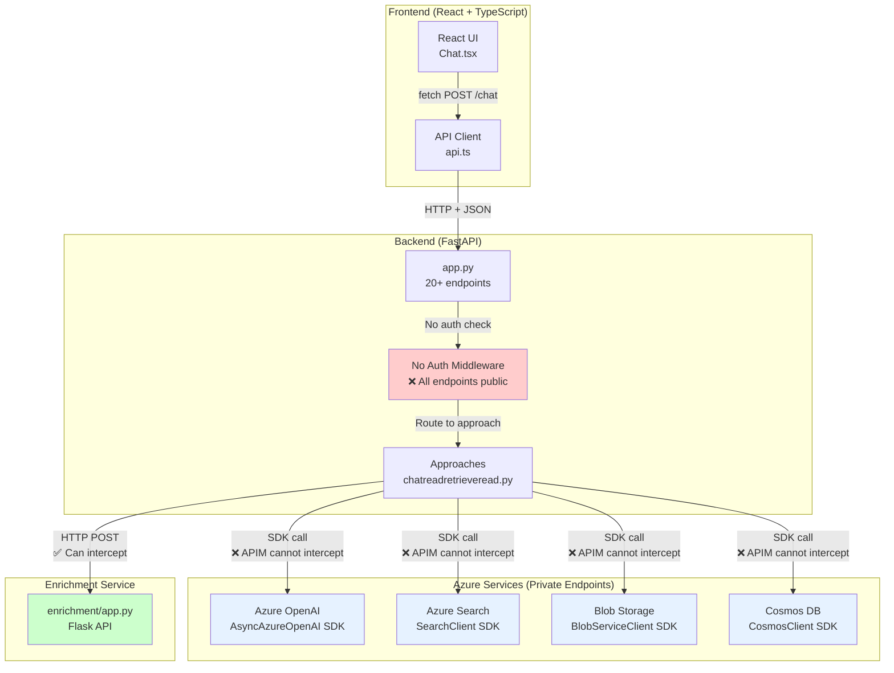

# Current Architecture (No APIM)

**Status**: Evidence-based diagram from Phase 2 analysis  
**Sources**: [01-api-call-inventory.md](../docs/apim-scan/01-api-call-inventory.md), [02-auth-and-identity.md](../docs/apim-scan/02-auth-and-identity.md)

---

## Architecture Diagram



---

## Key Observations [FACT]

### Security Gaps
- ❌ **No user authentication** - All endpoints publicly accessible [02-auth-and-identity.md:120-160]
- ❌ **No authorization** - No role-based access control
- ❌ **No rate limiting** - Vulnerable to abuse
- ❌ **No request logging** - Limited observability

### SDK Integration Pattern
- ✅ **Service-to-service auth works** - Managed Identity → Azure services [02-auth-and-identity.md:40-120]
- ❌ **APIM cannot intercept SDK calls** - SDKs bypass HTTP proxies [CRITICAL-FINDINGS-SDK-REFACTORING.md:45-80]
- ✅ **Enrichment service is HTTP** - Can be fronted by APIM [01-api-call-inventory.md:180-220]

### API Surface
- **20+ HTTP endpoints** documented [01-api-call-inventory.md:20-250]
- **3 streaming endpoints** using SSE [04-streaming-analysis.md]
- **7 file management endpoints** [01-api-call-inventory.md:60-120]

---

## Current Request Flow

```
1. User → Browser → React UI
2. React UI → fetch() → api.ts
3. api.ts → HTTP POST /chat → FastAPI app.py
4. app.py → No auth check → route handler
5. Route handler → Approach class (e.g., chatreadretrieveread.py)
6. Approach → Azure SDK calls:
   - AsyncAzureOpenAI.create() → Azure OpenAI
   - SearchClient.search() → Azure Cognitive Search
   - BlobServiceClient.download_blob() → Azure Blob Storage
   - CosmosClient.upsert_item() → Azure Cosmos DB
7. Approach → HTTP POST → Enrichment Service (embeddings)
8. Response streams back to user (SSE/ndjson)
```

**Problem**: No governance layer between steps 3-4. All requests accepted without validation.

---

## Evidence References

- **[FACT: 01-api-call-inventory.md:23-56]** - Chat endpoint flow
- **[FACT: 01-api-call-inventory.md:180-220]** - Azure SDK usage patterns
- **[FACT: 02-auth-and-identity.md:125-145]** - No user auth detected
- **[FACT: CRITICAL-FINDINGS-SDK-REFACTORING.md:65-85]** - SDK bypass APIM constraint
