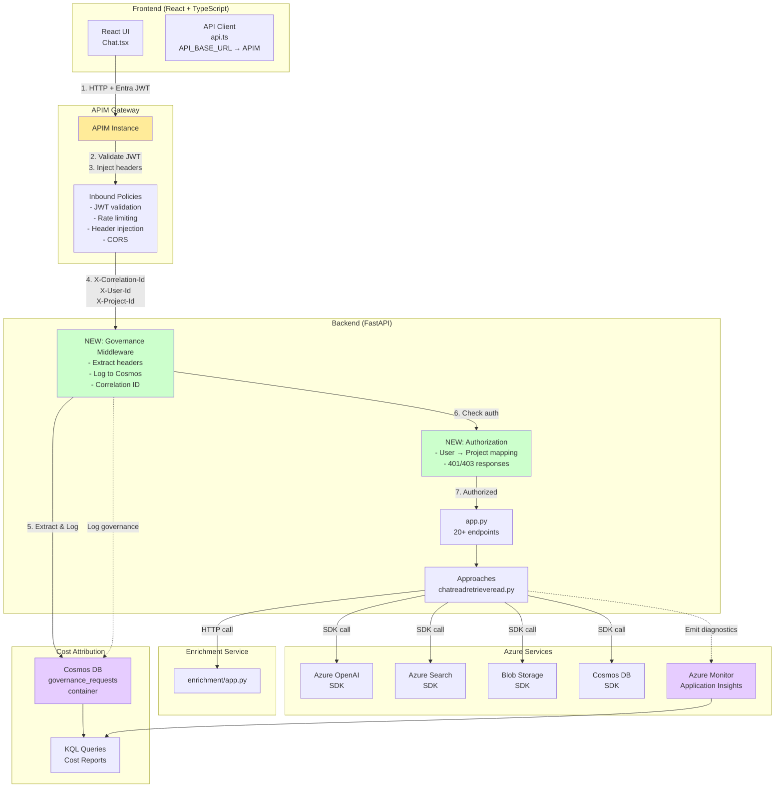

# Target APIM Architecture (Recommended)

**Status**: Recommended design from Phase 3-5 planning  
**Sources**: [PLAN.md](../PLAN.md), [05-header-contract-draft.md](../docs/apim-scan/05-header-contract-draft.md)

---

## Architecture Diagram



---

## Key Improvements [RECOMMENDATION]

### Security Enhancements
- ✅ **JWT validation** - Entra ID token verification in APIM [PLAN.md:151-250]
- ✅ **Authorization** - User → project mapping enforced [PLAN.md:251-300]
- ✅ **Rate limiting** - 100 req/min per user, 10k/min per app
- ✅ **CORS policy** - Controlled origin access

### Governance Layer
- ✅ **Header injection** - APIM adds X-Correlation-Id, X-Caller-App, X-Env [05-header-contract-draft.md:50-400]
- ✅ **Middleware logging** - All requests logged to Cosmos DB [PLAN.md:151-250]
- ✅ **Cost attribution** - Track by user, project, run, variant

### Observability
- ✅ **Correlation IDs** - End-to-end request tracing
- ✅ **Azure Monitor integration** - SDK call diagnostics
- ✅ **Cost reports** - Match APIM logs + SDK diagnostics

---

## Target Request Flow [RECOMMENDATION]

```
1. User → Browser → React UI
2. React UI → fetch() + JWT → api.ts
3. api.ts → HTTPS POST /chat + Bearer token → APIM
4. APIM → Validate JWT (Entra ID)
5. APIM → Inject headers:
   - X-Correlation-Id: {uuid}
   - X-User-Id: {from JWT oid claim}
   - X-Caller-App: InfoJP
   - X-Env: sandbox
   - X-Project-Id: {from client}
6. APIM → Forward to FastAPI backend
7. Backend Middleware → Extract headers → Log to Cosmos governance_requests
8. Authorization → Check user has access to X-Project-Id
9. If authorized → Route handler → Approach
10. Approach → Azure SDK calls (same as before)
11. Middleware → Add X-Correlation-Id to response
12. APIM → Return response to client
```

**Benefit**: Every request has governance metadata, auth enforced, cost trackable.

---

## Cost Attribution Strategy [RECOMMENDATION: PLAN.md:350-450]

### Layer 1: APIM + Application Insights
- Track: Request volume, latency, errors
- Group by: User, project, correlation ID

### Layer 2: Azure Monitor SDK Diagnostics
- Track: OpenAI tokens, Search queries, Blob operations, Cosmos RUs
- Match on: Correlation ID (requires SDK diagnostic settings)

### Layer 3: Cosmos DB Governance Logs
- Store: Every request with headers, endpoint, status, duration
- Query: Cost reports by project, run, variant

---

## MVP Requirements [RECOMMENDATION: PLAN.md:650-667]

1. ✅ All UI calls routed through APIM
2. ✅ Headers propagated end-to-end
3. ✅ Cost attribution reports operational
4. ✅ Authorization enforced (user → project mapping)
5. ✅ Governance metadata in Cosmos DB

---

## Implementation References

- **[RECOMMENDATION: PLAN.md:44-85]** - Phase 3 APIM Design
- **[RECOMMENDATION: PLAN.md:151-195]** - Phase 4A Governance Middleware
- **[RECOMMENDATION: PLAN.md:251-285]** - Phase 4B Authorization
- **[FACT: 05-header-contract-draft.md:50-120]** - Header specification
