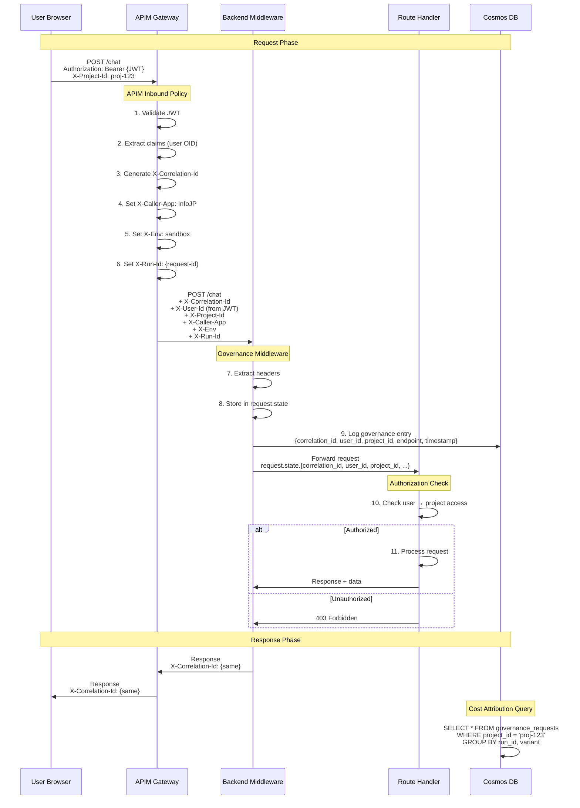

# Header Flow Sequence Diagram

**Status**: Design specification from Phase 2 analysis  
**Sources**: [05-header-contract-draft.md](../docs/apim-scan/05-header-contract-draft.md), [PLAN.md Phase 4A](../PLAN.md)

---

## Sequence Diagram



---

## Header Specifications [FACT: 05-header-contract-draft.md:50-120]

### Required Headers (MVP)

| Header | Source | When Set | Purpose | Example |
|--------|--------|----------|---------|---------|
| **X-Correlation-Id** | APIM generates | Step 3 | Request tracing across services | `550e8400-e29b-41d4-a716-446655440000` |
| **X-User-Id** | APIM from JWT | Step 2 | User identity from Entra OID claim | `xxxxxxxx-xxxx-xxxx-xxxx-xxxxxxxxxxxx` |
| **X-Project-Id** | Client sends | Request | Project isolation and cost attribution | `proj-infojp-001` |
| **X-Caller-App** | APIM sets | Step 4 | Application identifier | `infojp-web`, `infojp-batch` |
| **X-Env** | APIM sets | Step 5 | Environment context | `dev`, `staging`, `prod`, `sandbox` |
| **X-Run-Id** | APIM generates | Step 6 | Batch/ingestion run tracking | `batch-2024-01-25-001` |
| **X-Cost-Center** | Backend derives | Step 8 | Cost allocation (optional) | `CC-12345` |
| **X-Ingestion-Variant** | Client sends | Request | A/B testing (optional) | `control`, `variant-a` |

### Response Headers

| Header | Source | Purpose |
|--------|--------|---------|
| **X-Correlation-Id** | Middleware echoes | Client can correlate logs |

---

## Middleware Implementation [RECOMMENDATION: PLAN.md:151-250]

```python
@app.middleware("http")
async def extract_governance_headers(request: Request, call_next):
    # Step 7: Extract headers
    correlation_id = request.headers.get("X-Correlation-Id", str(uuid.uuid4()))
    user_id = request.headers.get("X-User-Id", "anonymous")
    project_id = request.headers.get("X-Project-Id", "unknown")
    run_id = request.headers.get("X-Run-Id", "")
    caller_app = request.headers.get("X-Caller-App", "unknown")
    env = request.headers.get("X-Env", "unknown")
    
    # Step 8: Store in request.state
    request.state.correlation_id = correlation_id
    request.state.user_id = user_id
    request.state.project_id = project_id
    request.state.run_id = run_id
    request.state.caller_app = caller_app
    request.state.env = env
    
    # Step 9: Log to Cosmos governance_requests
    log_entry = {
        "id": str(uuid.uuid4()),
        "timestamp": datetime.utcnow().isoformat(),
        "correlation_id": correlation_id,
        "user_id": user_id,
        "project_id": project_id,
        "run_id": run_id,
        "caller_app": caller_app,
        "env": env,
        "endpoint": request.url.path,
        "method": request.method,
    }
    await cosmos_client.create_item(
        database_id="conversations",
        container_id="governance_requests",
        item=log_entry
    )
    
    # Forward to handler
    response = await call_next(request)
    
    # Add correlation ID to response
    response.headers["X-Correlation-Id"] = correlation_id
    return response
```

---

## Cosmos DB Schema [RECOMMENDATION: PLAN.md:300-350]

### governance_requests Collection

```json
{
  "id": "uuid",
  "timestamp": "2026-01-28T10:30:00Z",
  "correlation_id": "550e8400-e29b-41d4-a716-446655440000",
  "user_id": "entra-oid",
  "project_id": "proj-infojp-001",
  "run_id": "batch-2024-01-25-001",
  "ingestion_variant": "control",
  "cost_center": "CC-12345",
  "caller_app": "infojp-web",
  "env": "sandbox",
  "endpoint": "/chat",
  "method": "POST",
  "status_code": 200,
  "duration_ms": 1250,
  "error": null,
  "user_agent": "Mozilla/5.0...",
  "client_ip": "10.0.0.1"
}
```

**Partition Key**: `/correlation_id` (high cardinality)  
**Indexes**: `timestamp`, `user_id`, `project_id`, `run_id`, `ingestion_variant`  
**TTL**: 90 days (cost optimization)

---

## Cost Attribution Queries [RECOMMENDATION: PLAN.md:360-405]

### Query 1: Cost by Project
```sql
SELECT 
    project_id,
    COUNT(*) as request_count,
    AVG(duration_ms) as avg_latency,
    SUM(CASE WHEN status_code >= 400 THEN 1 ELSE 0 END) as error_count
FROM governance_requests
WHERE timestamp >= '2026-01-01'
GROUP BY project_id
ORDER BY request_count DESC
```

### Query 2: Run Comparison (A/B Testing)
```sql
SELECT 
    ingestion_variant,
    run_id,
    COUNT(*) as requests,
    AVG(duration_ms) as avg_latency,
    SUM(CASE WHEN status_code = 200 THEN 1 ELSE 0 END) as success_count
FROM governance_requests
WHERE project_id = 'proj-infojp-001'
    AND run_id IN ('run-001', 'run-002')
GROUP BY ingestion_variant, run_id
```

---

## Evidence References

- **[FACT: 05-header-contract-draft.md:50-120]** - X-Correlation-Id specification
- **[FACT: 05-header-contract-draft.md:151-200]** - X-Run-Id, X-Caller-App specs
- **[FACT: 05-header-contract-draft.md:260-310]** - APIM inbound policy examples
- **[RECOMMENDATION: PLAN.md:151-195]** - Middleware implementation pattern
