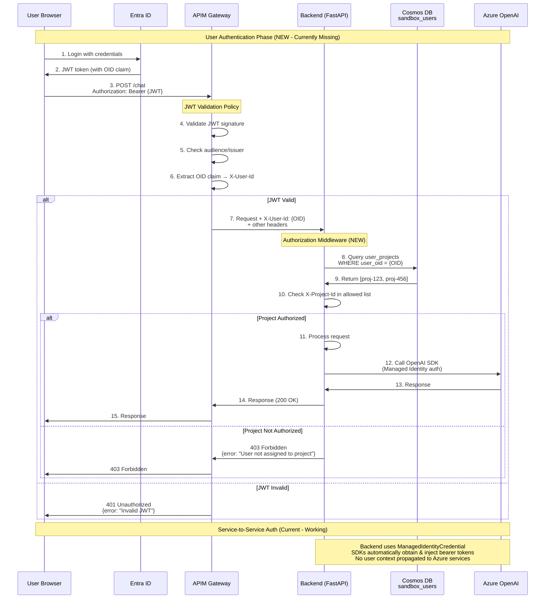

# Authentication Flow Diagram

**Status**: Current gaps + recommended implementation  
**Sources**: [02-auth-and-identity.md](../docs/apim-scan/02-auth-and-identity.md), [PLAN.md Phase 4B](../PLAN.md)

---

## Sequence Diagram



---

## Current State (No User Auth) [FACT: 02-auth-and-identity.md:125-148]

### Problems
- ❌ **All endpoints public** - No JWT validation
- ❌ **No user identity** - Cannot track who made request
- ❌ **No authorization** - No project-level access control
- ❌ **No user profiles** - No sandbox_users table

### What Works
- ✅ **Service-to-service auth** - Managed Identity → Azure services [FACT: 02-auth-and-identity.md:40-75]
- ✅ **Token refresh automatic** - SDKs handle token lifecycle
- ✅ **Secure credential storage** - No secrets in code

---

## Target State (With User Auth) [RECOMMENDATION: PLAN.md:251-285]

### Phase 4B: Authorization Enforcement

**Step 1: Frontend OAuth 2.0** (Not in scope for backend)
- React app initiates Entra ID login flow
- User authenticates with credentials
- Entra ID returns JWT with claims (OID, email, roles)

**Step 2: APIM JWT Validation Policy**
```xml
<inbound>
  <validate-jwt header-name="Authorization" failed-validation-httpcode="401">
    <openid-config url="https://login.microsoftonline.com/{tenant}/.well-known/openid-configuration" />
    <audiences>
      <audience>api://infojp-backend</audience>
    </audiences>
    <issuers>
      <issuer>https://sts.windows.net/{tenant}/</issuer>
    </issuers>
    <required-claims>
      <claim name="oid" match="any">
        <value>.*</value>
      </claim>
    </required-claims>
  </validate-jwt>
  
  <set-header name="X-User-Id" exists-action="override">
    <value>@(context.Request.Headers.GetValueOrDefault("Authorization","").AsJwt()?.Claims["oid"].FirstOrDefault())</value>
  </set-header>
</inbound>
```

**Step 3: Backend Authorization Middleware**
```python
@app.middleware("http")
async def enforce_authorization(request: Request, call_next):
    # Skip auth for public endpoints
    if request.url.path in ["/health", "/docs", "/openapi.json"]:
        return await call_next(request)
    
    # Extract user and project from headers
    user_id = request.state.user_id  # From governance middleware
    project_id = request.state.project_id
    
    # Check if user has access to project
    user_projects = await get_user_projects(user_id)  # Cosmos DB query
    
    if project_id not in user_projects:
        return JSONResponse(
            status_code=403,
            content={
                "error": "Forbidden",
                "message": f"User {user_id} not assigned to project {project_id}",
                "correlation_id": request.state.correlation_id
            }
        )
    
    # User authorized, proceed
    return await call_next(request)
```

---

## Cosmos DB Schema [RECOMMENDATION: PLAN.md:300-350]

### sandbox_users Collection
```json
{
  "id": "entra-oid",
  "entra_oid": "xxxxxxxx-xxxx-xxxx-xxxx-xxxxxxxxxxxx",
  "email": "user@example.com",
  "display_name": "User Name",
  "created_at": "2026-01-01T00:00:00Z",
  "last_login": "2026-01-28T10:00:00Z",
  "active": true
}
```

### projects Collection
```json
{
  "id": "proj-infojp-001",
  "project_id": "proj-infojp-001",
  "display_name": "InfoJP Sandbox",
  "cost_center": "CC-12345",
  "budget_monthly": 1000.0,
  "created_at": "2026-01-01T00:00:00Z",
  "active": true
}
```

### user_projects Collection (Junction)
```json
{
  "id": "uuid",
  "user_oid": "entra-oid",
  "project_id": "proj-infojp-001",
  "role": "user",
  "assigned_at": "2026-01-01T00:00:00Z",
  "assigned_by": "admin-oid"
}
```

---

## Protected vs. Unprotected Endpoints [RECOMMENDATION]

### Protected (Require JWT + Project Access)
```
POST /chat
GET  /stream
GET  /tdstream
POST /file
POST /getalluploadstatus
POST /getfolders
POST /gettags
POST /deleteItems
POST /resubmitItems
POST /logstatus
POST /getcitation
POST /get-file
GET  /getalltags
POST /posttd
GET  /process_td_agent_response
GET  /getTdAnalysis
GET  /getHint
GET  /process_agent_response
```

### Unprotected (Public)
```
GET  /health              → Liveness probe
GET  /docs                → API documentation
GET  /openapi.json        → OpenAPI spec
POST /feedback            → Anonymous feedback (optional)
```

---

## Implementation Effort [RECOMMENDATION: PLAN.md:251-300]

**Phase 4B: Authorization Enforcement**
- **Effort**: 8-12 hours
- **Timeline**: 2-3 days
- **Owner**: Backend Developer + Security Engineer
- **Dependencies**: 
  - Phase 4A (Governance middleware in place)
  - Phase 4C (Cosmos collections created)
- **Critical**: 🔴 Required before public exposure

---

## Evidence References

- **[FACT: 02-auth-and-identity.md:125-145]** - Current: No user auth, all endpoints public
- **[FACT: 02-auth-and-identity.md:40-75]** - Service-to-service auth (Managed Identity)
- **[RECOMMENDATION: PLAN.md:251-300]** - Phase 4B Authorization implementation
- **[RECOMMENDATION: 02-auth-and-identity.md:310-350]** - Required steps to add user auth
